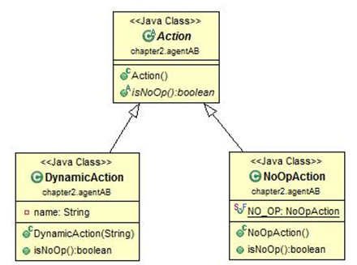
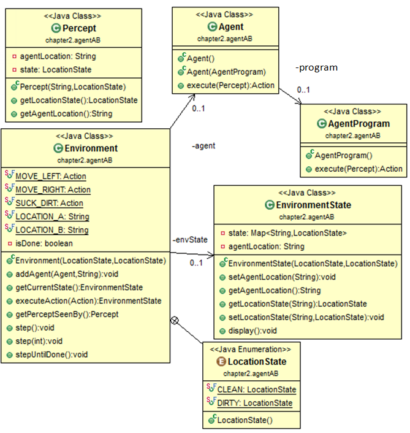

AI - LAB - NLU

(Semester 1, 2023/2024)

Lab #1: Intelligent Agents

The main aim of the lab is to implement a simple reflex agent in the case of a vacuum cleaner (single agent).

For a given class diagram as follows: 

DynamicAction	represents	for	SUCK,  MOVE_LEFT,  MOVE_RIGHT  actions.

NoOpAction represents for NO_OP action. Other classes:

Page 1

AI - LAB - NLU

(Semester 1, 2023/2024)

Task 1: Implement an agent program for a simple reflex agent working in the 2 squares [A,

B] environment:

In AgentProgram.java:

public Action execute(Percept p) {//Percept: location and status/state
//TODO

return null;
}

Pseudocode is described in the following figure.

Then, implement the following methods in Enviroment.java: Environment has an EnvironmentState object to track the states of locations in the environment.

// add an agent into the environment

public void addAgent(Agent agent, String location) {
//	TODO
}

//	Update environment state when the agent does an action public EnvironmentState executeAction(Action action) {
//	TODO
return envState;
}

//	get percept<AgentLocation, LocationState> at the current location where the agent is in.

public Percept getPerceptSeenBy() {

//	TODO return null;
}

Test: TestSimpleReflexAgent.java

//Environment with [A=CLEAN, B=DIRTY]

Environment env = new Environment(Environment.LocationState.CLEAN, Environment.LocationState.DIRTY);
Agent agent = new Agent(new AgentProgram());

env.addAgent(agent, Environment.LOCATION_A);//Add an agent at location A

env.step(3);

The output is as follows:

Page 2

AI - LAB - NLU

(Semester 1, 2023/2024)

Environment state:
{A=CLEAN, B=DIRTY}
Agent Loc.: A Action: RIGHT

Environment state:
{A=CLEAN, B=DIRTY}

-------------------------
Environment state:

{A=CLEAN, B=DIRTY}
Agent Loc.: B Action: SUCK

Environment state:
{A=CLEAN, B=CLEAN}

-------------------------
Environment state:

{A=CLEAN, B=CLEAN}
Agent Loc.: B Action: LEFT

Environment state:
{A=CLEAN, B=CLEAN}

-------------------------

==================================================================

Task 2: Expand the above vacuum cleaner according to the following requirements:

•	Agent actions: SUCK, LEFT, RIGHT, UP, DOWN

•	Environment: 4 squares including A, B, C, D

•	State of each location: CLEAN, DIRTY

•	If the current cell is DIRTY, then action SUCK is invoked

•	If the current cell is CLEAN, then pick a random action (UP, DOWN, LEFT, RIGHT), and perform the move action (if can’t move there (i.e., the agent cannot move UP or LEFT if it is at A), then will remain in the same cell).

•	Performance measure (score):

o	For action SUCK: + 500 points;

o	If the agent can't move: - 100 points; o For other actions: - 10 points each;

==================================================================

Task 3 (advanced): Expand the above vacuum cleaner according to the following requirements:

•	Environment is an m × n grid (the room is divided into a discrete number of cells)

•	There exist a number of dirt and obstacles in the environment. Dirt and obstacles (walls)

are randomly placed in the cells at a given rate. Therefore, the number of obstacles will be m*n*DIRT_RATE (suppose DIRT_RATE = 0.2; WALL_RATE = 0.1)

•	At each step:

–   if the current cell is DIRTY, then action SUCK is invoked

Page 3

AI - LAB - NLU

(Semester 1, 2023/2024)

– if the current cell is CLEAN, then pick a random action (UP, DOWN, LEFT, RIGHT), and perform the move action (if can’t move there (i.e., because of obstacle), then will remain in the same cell).

–   For example, if the action is UP, then the agent will move up 1 cell.

•	Performance measure (score):

–   For action SUCK, + 500 points;

–   If the agent can't move (because of obstacle) - 100 points;

–   For other actions: - 10 points each;

•	Develop the GUI for the vacuum agent in the grid environment as suggested (optional):

Implement necessary methods to simulate the reflex agent using the above description.

