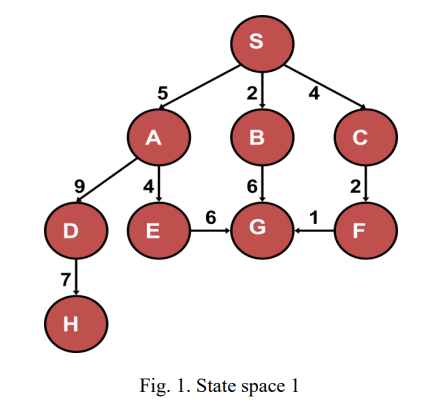
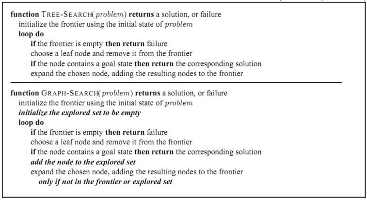
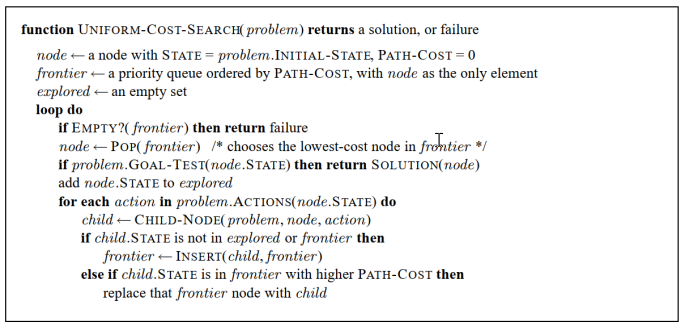
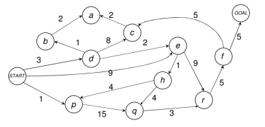
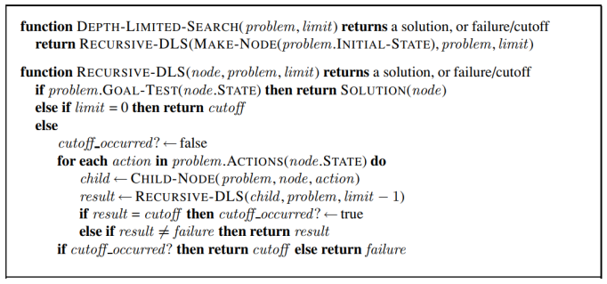
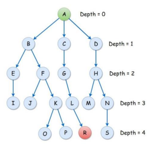

AI - LAB - NLU

(Semester 1, 2023/2024)

**Lab #2, 3**: Uninformed Search Algorithms

The main aim of these labs is to deal with uninformed search algorithms using the graph

search and tree search approaches.

For a given state space with nodes and weights of each edge described in the following

figure:

The node structure used for the tasks of uninformed search is defined as follows:

**public class** Node **implements** Comparable<Node> {

**private** String label;

**private** Node parent; // for printing the path from the start

node to the goal node

**private double** pathCost;// from the root node to this node

**private** List<Edge> children = **new** ArrayList<Edge>();

**public** Node(String label) {

**this**.label = label;

}

**public** Node(String label, **int** h) {

**this**.label = label;

}

//...

Each Node has a label and a path cost (*computed from the start node*) and a list of children

presented as edges. Each edge includes **begin** and the **end** nodes. We can build the state

space by the **addEdge** methods as follows:

• **addEdge (Node that, double weight)**: add an edge connecting the current node with

that node. The weight is given as the second parameter.

Page 1

AI - LAB - NLU

(Semester 1, 2023/2024)

• **addEdge(Node that)**: add an edge connecting the current node with that node. The

default weight is 1. **This option is used for non-weighted trees.**

**Parent** attribute is used to **track the found path** from the Start node to the Goal node (or

from the Root node to the Goal node).

**public class** Edge **implements** Comparable<Edge>{

**private** Node begin;

**private** Node end;

**private double** weight;

**public** Edge(Node begin, Node end, **double** weight) {

**super**();

**this**.begin = begin;

**this**.end = end;

**this**.weight = weight;

}

**public** Edge(Node begin, Node end) {

**this**.begin = begin;

**this**.end = end;

**this**.weight = 1;

}

//...

Next, the interface **ISearchAlgo.java** defined 2 execute methods:

**public** Node execute(Node root, String goal);// find the path from root node

//to the goal node

**public** Node execute(Node root, String start, String goal); // find the path

//from start node to the goal node

**Notice that, the traversal of nodes is in alphabetical order.**

\==================================================================

For **BreadthFirstSearchAlgo**, the frontier is a queue:

Queue<Node> frontier = **new** LinkedList<Node>();

For **DepthFirstSearchAlgo**, the frontier is a stack:

Stack<Node> frontier = **new** Stack<Node>();

Pseudocode for searching algorithms:

Page 2

AI - LAB - NLU

(Semester 1, 2023/2024)

Fig. 2. Tree Search and Graph Search

**==================================================================**

**Task 1:** Implement execute(Node root, String goal) in **BreadthFirstSearchAlgo.java** and

**DepthFirstSearchAlgo.java** using the graph search approach.

**==================================================================**

In this task, the parent attribute is used to track the found path from the Root node (or the

Start node) to the Goal node (**NodeUtils.java**):

**public static** List<String> printPath(Node node) {

List<String> result = **new** ArrayList<String>();

result.add(node.getLabel());

Node tmp;

**while** ((tmp = node.getParent()) != **null**) {

result.add(tmp.getLabel());

node = tmp;

}

Collections.*reverse*(result);

**return** result;

}

Using the following nodes (see Fig. 1) for testing:

Node nodeS = **new** Node("S");

Node nodeA = **new** Node("A"); Node nodeB = **new** Node("B");

Node nodeC = **new** Node("C"); Node nodeD = **new** Node("D");

Node nodeE = **new** Node("E"); Node nodeF = **new** Node("F");

Node nodeG = **new** Node("G"); Node nodeH = **new** Node("H");

nodeS.addEdge(nodeA, 5);

nodeS.addEdge(nodeC, 4);

nodeA.addEdge(nodeE, 4);

nodeS.addEdge(nodeB, 2);

nodeA.addEdge(nodeD, 9);

nodeB.addEdge(nodeG, 6);

Page 3

AI - LAB - NLU

(Semester 1, 2023/2024)

nodeC.addEdge(nodeF, 2);

nodeE.addEdge(nodeG, 6);

nodeD.addEdge(nodeH, 7);

nodeF.addEdge(nodeG, 1);

ISearchAlgo algo1 = **new** BreadthFirstSearchAlgo();

Node result = algo1.execute(nodeS, "G");

\==================================================================

**Task 2:** Similar to Task 1, implement method execute(Node root, String start, String goal) in

**BreadthFirstSearchAlgo.java**, **DepthFirstSearchAlgo.java** using the graph search

approach.

**==================================================================**

**Task 3:** Modify the implemented methods in **Task 1** and **Task 2** using the tree search

approach.

**==================================================================**

**Task 4:** Implement execute(Node root, String goal) in **UniformCostSearchAlgo.java**

(implements **ISearchAlgo**)

**==================================================================**

For **UniformCostSearchAlgo**, the frontier is **PriorityQueue**:

PriorityQueue<Node>

NodeComparator());

frontier

\=

new

PriorityQueue<Node>(new

**NodeComparator** is used for comparing the path costs of two nodes. Pseudocode for UCS

(graph search):

Fig. 3. Uniform cost search

\==================================================================

Page 4

AI - LAB - NLU

(Semester 1, 2023/2024)

**Task 5:** Similar to Task 2, implement method execute(Node root, String start, String goal) in

**UniformCostSearchAlgo.java**

**==================================================================**

**Additional task**: test all implementations with the following tree:

Fig. 4. State space 2
**Task 6**

Using

**Depth-limited**

**search**,

implement

the

methods

public Node execute(Node root, String goal, int limitedDepth)

*Pseudocode*:

Fig. 5. Depth-limited tree search

Fig. 6. State space 3

