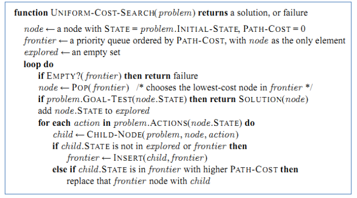
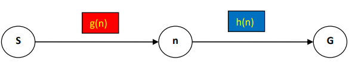

AI - LAB - NLU

(Semester 1, 2023/2024)

**Lab #4**: Informed Search

The Node structure in Lab #2,3 is modified by adding heuristic value (**h**) as follows:

**public class** Node {

**private** String label;

**private** Node parent; // for printing the path from the start node to

//goal node

**private double** g;// cost from the Start node to this node

**private double** h;// heuristic cost from this node to the Goal node

**private** List<Edge> children = **new** ArrayList<Edge>();

Next, the interface **IInformedSearchAlgo.java** defined the execute method as follows:

**public interface** IInformedSearchAlgo {

**public** Node execute(Node root, String goal);

**public** Node execute(Node root, String start, String goal);

}

\==================================================================

Pseudocode of Uniform Cost Search (UCS) can be used to implement Greedy best-first

search and A\* search.

The costs used in UCS, Greedy, and A\* are as follows:

} **Uniform-cost search**: expand the lowest path cost

**f(n) = g(n)**

} **Greedy best-first search**: expand the node closest to the goal. *No pathcost is needed.*

**f(n) = h(n)**

} **A\* search**: combine UCS and Greedy (minimizing the total estimated solution cost)

**f(n) = g(n) + h(n)**

1

AI - LAB - NLU

(Semester 1, 2023/2024)

Where g(n) represents the path cost from the Start node to n, h(n) represents the heuristic cost

from n to the Goal.

\==================================================================

**Task 1:** Implement ***execute(Node root, String goal)*** in **GreedyBestFirstSearchAlgo.java**

**Task 2:** Implement ***execute(Node root, String goal)*** in **AStarSearchAlgo.java**

*Notice that, using PriorityQueue for frontier and implementing Comparable interface for*

*Node object (or using Comparator).*

PriorityQueue<Node> frontier = **new** PriorityQueue<Node>(**new**

NodeComparatorByGn());// if NodeComparatorByGn is defined as an

//implementation of interface **Comparator** for comparing 2 nodes, or

\===========================================================================

PriorityQueue<Node> frontier = **new** PriorityQueue<Node>();// if Node is

//implemented interface **Comparable**

In the case of using **GreedyBestFirstSearchAlgo**, if two nodes have the same heuristic, then

the priority is based on the alphabets of node labels. The Comparator is defined as follows:

**class** NodeComparatorByHn **implements** Comparator<Node> {

@Override

**public int** compare(Node o1, Node o2) {

Double h1 = o1.getH();

Double h2 = o2.getH();

**int** result = h1.compareTo(h2);

**if** (result == 0)

**return** o1.getLabel().compareTo(o2.getLabel());

**else**

**return** result;

}

}

Test the implemented algorithms with the following state space:

Fig. 1. State space 1

2

AI - LAB - NLU

(Semester 1, 2023/2024)

**The result using A\*:**

Later, test the implemented algorithms with the following state space (*find the path from S to*

*G1 or G2*):

Fig. 2. State space 2

Notice that each node includes: a **label** and **heuristic cost** to the closest Goal.

**Task 3:** Implement the method ***public boolean isAdmissibleH(Node root, String goal)*** to

check whether given heuristic values are admissible or not.

Notice that, a heuristic is admissible if it never overestimates the cost to reach the goal. The

true cost of a given node to the goal is found by using A\*

• h(n) <= h\*(n) where h\*(n) is the true cost from n to goal

• h(n) >= 0 so h(G)=0 for any goal G.

**Task 4:** Implement ***Node execute(Node root, String start, String goal)*** in the greedy best-

first search and A\* search algorithms to find a path from **Start** to **Goal** (not from the Root to

Goal as in Tasks 1, 2).

3

