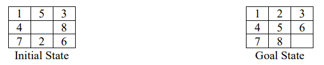
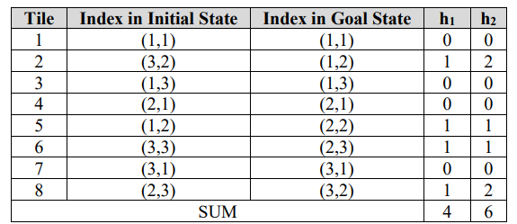
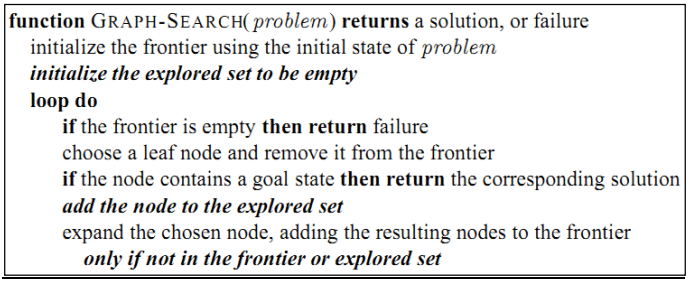
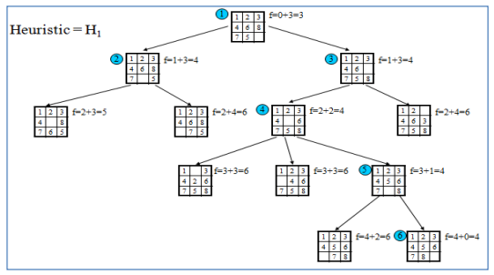
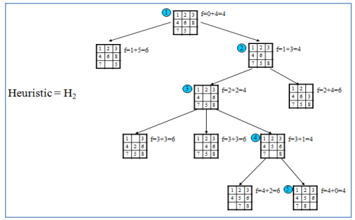

AI - LAB - NLU

(Semester 1, 2023/2024)

**Lab #5**: Informed search (cont.)

The main aim of this lab is to solve the problem of an 8-puzzle using **Greedy Best First**

**Search** and **A\* Search**.

For given states of the 8-puzzle problem as follows:

Two measures can be used for computing heuristics:

• h1: The number of tiles out of place

• h2: Sum of distances of tiles from goal positions, using Manhattan distance

The computation of these measures is described in the following table:

**Tile Index in Initial State Index in Goal State**

<b>h1 h2</b>

The costs used in Greedy, and A\* are as follows:

} **Greedy best-first search**: expand the node that is closest to the goal

**f(n) = h(n)**

} **A\* search**: combine UCS and Greedy (minimizing the total estimated solution cost)

**f(n) = g(n) + h(n)**

\==================================================================

The main aim of the algorithm for solving 8 puzzles is based on moving white tile (**UP,**

**DOWN, LEFT, RIGHT**) to get new successors. Then using the measure f(n) = g(n) + h(n)

(as in A\* algorithm) or f(n) = h(n) (in the case of Greedy Best First Search) to choose the

next state -with the lowest f(n) to expand. The procedure is repeated until f(n) = 0.

In this lab, the initial state and the goal state are represented in **PuzzleMap.txt** and

**PuzzleGoalState.txt.** The code for loading these states was implemented in **Puzzle** class.

Page 1

AI - LAB - NLU

(Semester 1, 2023/2024)

***Notice that: Ignore moves that return you to the previous state***

**Task 1.** Implement the following methods in **Puzzle** class:

//Move white tile **UP**, **DOWN**, **LEFT**, **RIGHT**. Remember to check when a tile is

//out of the map.

**public** Node moveTile(Node currentState, **char** operator) {...}

**public int** computeH1(Node currentState) {...}

**public int** computeH2(Node currentState) {...}

The frontier is a PriorityQueue with comparator implementations defined in PuzzleUtils

class:

PriorityQueue<Node> frontier = **new**

PriorityQueue<Node>(PuzzleUtils.*HeuristicComparatorByH*);

The pseudo-code based on graph search that can be used:

**Task 2.** Solve the 8 puzzle problem using **Greedy Best First Search** with *h1 or h2*

introduced in the previous section (implements **IPuzzleAlgo** interface).

**Task 3.** Solve the 8 puzzle problem using A\* Search with ***h(n)**, **g(n)*** as the number of steps

traversed from the **Start** node to get to the current node, function ***h*** could be ***h1*** or ***h2*** as

introduced in the previous section.

**Case 1: f(n) = g(n) + h1(n)**

Page 2

AI - LAB - NLU

(Semester 1, 2023/2024)

**Case 2: f(n) = g(n) + h2(n)**

**Task 4. (Advanced)** Apply other algorithms to solve the 8-puzzle problem such as *DFS*,

*BFS,* and *local search (Hill climbing)* beside *Greedy best-first search* and *A\** algorithms

(implemented in the previous tasks). Then, present a comparison of selected algorithms in

terms of **running time**, and **the number of steps** to reach the goal state from the initial state.

