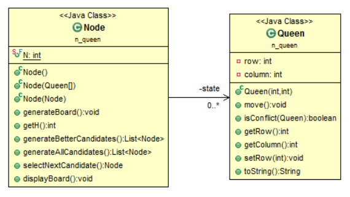
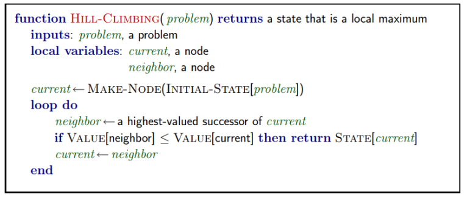
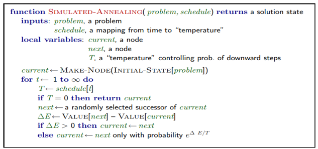

AI - LAB - NLU

(Semester 1, 2023/2024)

**Lab #6**: Local search algorithms

The main aim of this lab is to solve the problem of 8 Queen using **Hill climbing with**

**random restart** and **Simulated annealing algorithms.**

The problem statement is as follows: Consider an N × N chessboard. Place N queens on the

board such that no two queens are attacking each other. The queen is the most powerful piece

in chess and can attack from any distance horizontally, vertically, or diagonally. Thus, a

solution must place the queens such that no two queens are in the same row, the same

column, or along the same diagonal.

In this lab, the problem is solved using a **complete-state formulation** (N=8), which means

we start with **all 8 queens on the board**. We represent the 8 × 8 chessboard as a matrix. In

addition, we assume that each Queen is placed on a different column. Therefore, we try to

move the Queen to different row (each by one row) to reach a goal state.

The heuristic is measured by using:

• *h = the number of pairs of attacking queens*

Class diagram is described as follows:

Code:

**public class** Queen {

**private int** row;

**private int** column;

**public** Queen(**int** row, **int** column) {

**super**();

**this**.row = row;

**this**.column = column;

1

AI - LAB - NLU

(Semester 1, 2023/2024)

}

//...

**Node class:** each node includes N Queens and presents a state.

**public class** Node {

**public static final int *N*** = 8;

**private** Queen[] state;

**public** Node() {

// generateBoard();

state = **new** Queen[***N***];

}

**public** Node(Queen[] state) {

**this**.state = **new** Queen[***N***];

**for** (**int** i = 0; i < state.length; i++) {

**this**.state[i] = **new** Queen(state[i].getRow(),

state[i].getColumn());

}

}

**public** Node(Node n) {

**this**.state = **new** Queen[***N***];

**for** (**int** i = 0; i < ***N***; i++) {

Queen qi = n.state[i];

**this**.state[i] = **new** Queen(qi.getRow(),

qi.getColumn());

}

}

//...

}

**Task 1:** Implement the following methods in **Queen.java** class:

//Move the queen by 1 row

**public void** move() {...}

//Check whether this Queen can attack the given Queen (q)

**public boolean** isConflict(Queen q) {...}

**Task 2:** Implement the following methods in **Node.java** class:

**public int** getH() {

**int** heuristic = 0;

// Enter your code here

**return** heuristic;

}

**public** List<Node> generateAllCandidates() {

List<Node> result = **new** ArrayList<Node>();

2

AI - LAB - NLU

(Semester 1, 2023/2024)

// Enter your code here

**return** result;

}

**Task 3:** Implement execute for traditional Hill Climbing search and

executeHillClimbingWithRandomRestart to overcome the local optimum using

the given method named generateAllCandidates(in **Node.java** class) to generate all

candidates.

**public** Node execute(Node initialState) {

// Enter your code here.

**return null**;

}

**public** Node executeHillClimbingWithRandomRestart(Node

initialState) {

// Enter your code here.

**return null**;

}

The pseudocode of Hill Climbing Search:

Notice that, VALUE[neighbor] <= VALUE[current] means the current state is the best state.

Hill climbing algorithm reaches a peak.

The pseudocode of Hill Climbing Search with Random Restart:

**function**(initialState) {//Node initialState

state <- execute HillClimbingSearh(initialState);

//computeH(state)=0 means that the solution is found

while (computeH(state)!=0){

*// Random Restart If not a Solution.*

//generate new configuration of N Queens

3

AI - LAB - NLU

(Semester 1, 2023/2024)

state <- state.generateBoard();

state <- execute HillClimbingSearh(state);

}

return state;

};

**Additional task**. Using the following defined variable to track the information of the

implemented algorithms (defined in HillClimbingSearchNQueen class).

**int** stepClimbed = 0;

**int** stepClimbedAfterRandomRestart = 0;

**int** randomRestarts = 0;

**Task 4:** Apply SA alogrithm for NQueen problem, pseudocode is described as follows:

First, implement the following method to select a random successor of the current state.

**public** Node selectNextRandomCandidate() {

// Enter your code here.

**return** null;

}

Then, implement the SA algorithm w.r.t the following pseudo code as follows:

**Hint**: We can use the **h** measure as aforementioned as the value of **VALUE[next],**

**VALUE[current]**, cooling rate is used as a coefficient to decrease the temperature for each

iteration (see attached project applying SA algorithm to solve TSP problem).

4

