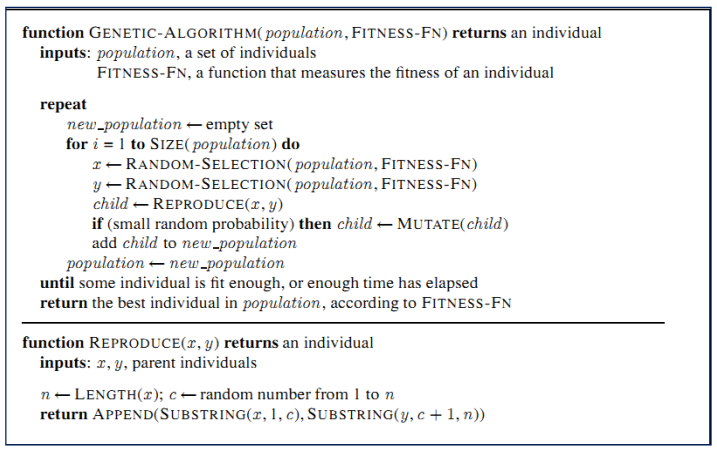

AI - LAB - NLU

(Semester 1, 2023/2024)

**Lab #7**: Genetic Algorithms

The main aim of this lab is to solve the problem of 8 Queen using **Genetic Algorithms.**

The problem statement is as follows: Consider an N × N chessboard. Place N queens on the

board such that no two queens are attacking each other. The queen is the most powerful piece

in chess and can attack from any distance horizontally, vertically, or diagonally. Thus, a

solution must place the queens such that no two queens are in the same row, the same

column, or along the same diagonal.

In this lab, the problem is solved using a **complete-state formulation** (N=8), which means

we start with **all 8 queens on the board**. We represent the 8 × 8 chessboard as a matrix. In

addition, we assume that each Queen is placed on a different column. Therefore, we try to

move the Queen to different rows (each by one row) to reach a goal state. The heuristic is

measured by using:

• *h = the number of pairs of attacking queens*

**(Use source code from the previous Lab)**

Implement the following methods in **GA\_NQueenAlgo** for Genetic Algorithms

**public class** GA\_NQueenAlgo {

**public static final int *POP\_SIZE*** = 100;//Population size

**public static final double *MUTATION\_RATE*** = 0.03;

**public static final int *MAX\_ITERATIONS*** = 1000;

List<Node> population = **new** ArrayList<Node>();

Random rd = **new** Random();

// initialize the individuals of the population

**public void** initPopulation() {

**for** (**int** i = 0; i < ***POP\_SIZE***; i++) {

Node ni = **new** Node();

ni.generateBoard();

population.add(ni);

}

}

**public** Node execute() {

// Enter your code here

**return** null;

}

// Mutate an individual by selecting a random Queen and

//move it to a random row.

**public void** mutate(Node node) {

// Enter your code here

**return** null;

}

Page 1

AI - LAB - NLU

(Semester 1, 2023/2024)

//Crossover x and y to reproduce a child

**public** Node reproduce(Node x, Node y) {

// Enter your code here

**return** null;

}

// Select K individuals from the population at random and

//select the best out of these to become a parent.

**public** Node getParentByTournamentSelection() {

// Enter your code here

**return** null;

}

//Select a random parent from the population

**public** Node getParentByRandomSelection() {

// Enter your code here

**return** null;

}

}

Pseudocode for execute is decribed as follows:

